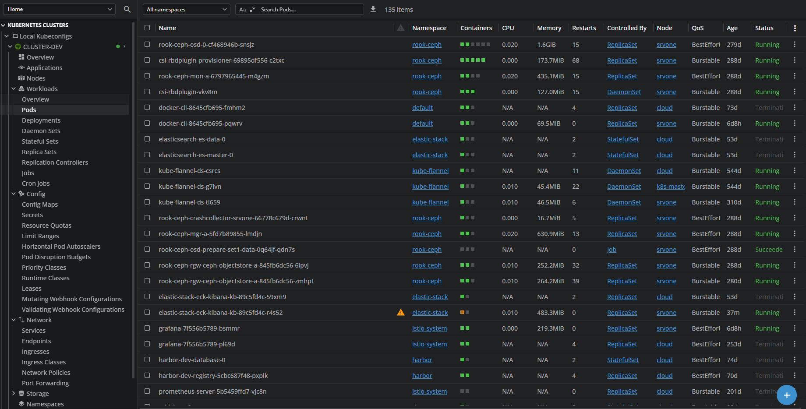
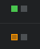
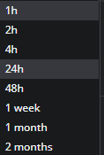

# **9. РАЗРАБОТКА ПОЛЬЗОВАТЕЛЬСКИХ ИНТЕРФЕЙСОВ (ПРОТОТИПЫ)**

## **1. ИНФОРМАЦИОННАЯ АРХИТЕКТУРА СИСТЕМЫ**

### **1.1. Карта навигации (структура интерфейса)**

```
Overview
├── Cluster
│   └── Selected Cluster
│       ├── Cluster Summary
│       ├── Nodes
│       ├── Workloads / Pods
│       ├── Events
│       |── Chart
│       │   ├── Chart List
│       │   ├── Chart Detail
│       │   │   ├── Jobs
│       │   │   ├── Logs
│       │   │   └── Artifacts
│       │   └── Runners
│       ├── Monitoring
│       │   ├── Metrics
│       │   │   ├── Cluster Metrics
│       │   │   ├── Workload Metrics
│       │   │   └── Custom Dashboards
│       │   ├── Alerts
│       │   └── Logs
│       ├── Audit
│       │   ├── User Actions
│       │   └── Search / Filter
│       └── Settings (Cluster-specific)
│           ├── RBAC / Users & Roles
│           ├── CI/CD Config
│           └── Integrations

```

---

### **1.2. Основные пользовательские пути**

#### **Сценарий 1 — Просмотр статуса пайплайна**

```
Overview → View Jobs → View Logs
```

#### **Сценарий 2 — Деплой и проверка кластера**

```
Overview → Clusters → Cluster Detail → Workloads → Pods → View Events
```

#### **Сценарий 3 — Просмотр/анализ логов**

```
Overview → Logs → Services → Search / Filter Logs
```

#### **Сценарий 4 — Анализ метрик и алертов**

```
Overview → Metrics → Cluster Metrics / Workload Metrics → Alerts List
```

---

## **2. МОДЕЛИ**

### **2.1. Overview — каркасная модель**

```
┌────────────────────────────── OVERVIEW ──────────────────────────────┐
│ [Logo]           [Cluster Menu: devcluster ▼]                        │
├──────────────────────────────────────────────────────────────────────┤
│ Filters: [Cluster ▼] [Service ▼] [Time range: from – to] [Apply]     │
├────────────────────────── System Status ─────────────────────────────┤
│ Clusters: 2 (1 Healthy | 1 Warning)  |  Pods: 350  |  Nodes: 18      │
│ Active Pipelines: 6   | Success Rate: 92%   | Failed Jobs: 3         │
├────────────────────────── Alerts Summary ────────────────────────────┤
│ 🔴 Critical: 2   🟠 High: 5   🟡 Medium: 8   ℹ Info: 12             │
├────────────────────────── Quick Actions ─────────────────────────────┤
│ [View Clusters]   [View Pipelines]   [View Registry]   [View Alerts] │
│ [Run Pipeline]    [Deploy Release]   [View Metrics]                  │
├───────────────────────── Recent Activity ────────────────────────────┤
│ 10:22  svc-api deployed release#324 (success)                        │
│ 10:25  ALERT High CPU usage on svc-api                               │
│ 10:27  Image svc-auth:2.1.0 pushed                                   │
│ 10:30  Pipeline #325 failed at job “test”                            │
└──────────────────────────────────────────────────────────────────────┘

```

---

### **2.2. CI/CD — Pipelines List**

```
┌─────────────────────────── Pipelines ─────────────────────────┐
| [Filters: Status][Branch][Author][Date Range]                 |
|---------------------------------------------------------------|
| ID  | Repo       | Branch | Status   | Duration | Started     |
| 324 | svc-api    | main   | ✓ success| 9m       | 2025-05-20  |
| 323 | svc-auth   | dev    | ✗ failed | 4m       | 2025-05-20  |
| …                                                             |
|---------------------------------------------------------------|
| [View Detail] [Retry] [Cancel]                                |
└───────────────────────────────────────────────────────────────┘
```

---

### **2.3. Monitoring — Metrics & Alerts**

```
┌────────────────────────────── MONITORING — METRICS & ALERTS ──────────────────────────────┐
| Фильтры: [Cluster] [Service] [Time range: с — по] [Применить]                             |
|-------------------------------------------------------------------------------------------|
|                                  Графики метрик                                           |
|-------------------------------------------------------------------------------------------|
| CPU Usage (%)      | ─────────────────── graph ───────────────────                        |
| Memory Usage (MB)  | ─────────────────── graph ───────────────────                        |
| Request Latency(ms)| ─────────────────── graph ───────────────────                        |
| Error Rate (%)     | ─────────────────── graph ───────────────────                        |
|-------------------------------------------------------------------------------------------|
|                                Список активных алертов                                    |
| ID   | Service   | Level   | Status   | Metric             | Triggered at | Acknowledge | |
|------|-----------|---------|----------|--------------------|--------------|-------------| |
| A101 | svc-api   | Critical| Active   | error_rate > 5%    | 2025-05-20   | [Ack]       | |
| A102 | svc-auth  | High    | Active   | latency > 500ms    | 2025-05-20   | [Ack]       | |
| A098 | svc-api   | Medium  | Resolved | cpu > 80%          | 2025-05-19   | —           | |
|-------------------------------------------------------------------------------------------|
|                                История алертов / фильтрация                               |
| [Filter: Service][Filter: Level][Filter: Status][Apply]                                   |
| ID   | Service   | Level   | Status   | Triggered At | Duration | Details                 |
|-------------------------------------------------------------------------------------------|
| A096 | svc-billing | High  | Resolved | 2025-05-18 10:15 | 5m     | High latency spike    |
| A097 | svc-auth    | Critical| Resolved| 2025-05-19 08:22 | 12m    | Repeated errors      |
└───────────────────────────────────────────────────────────────────────────────────────────┘

```

---

### **2.4. Audit / Logs**

```
┌────────────────────────────── AUDIT & LOGS ──────────────────────────────┐
|                                                                          |
|  Поиск записей аудита:                                                   |
|  [Пользователь] [Действие] [Ресурс] [Дата с] – [Дата по]   [Применить]   |
|                                                                          |
├────────────────────────────── История действий (Audit) ──────────────────┤
| Время            | Пользователь | Действие               | Ресурс        |
|------------------|--------------|------------------------|---------------|
| 2025-05-20 10:22 | devops1      | Deploy svc-api         | release#324   |
| 2025-05-20 10:25 | dev2         | Update config svc-auth | svc-auth      |
| 2025-05-20 10:30 | devops1      | Rollback svc-api       | release#323   |
| 2025-05-20 10:35 | auditor      | View logs svc-api      | svc-api       |
└──────────────────────────────────────────────────────────────────────────┘

┌────────────────────────────── Логи (Logs) ────────────────────────────────┐
| Фильтры: [Сервис] [Уровень] [Поиск текста] [Дата с – Дата по] [Применить] |
├───────────────────────────────────────────────────────────────────────────┤
| Время       | Сервис   | Уровень | Сообщение                              |
|-------------|----------|---------|----------------------------------------|
| 10:22:03 AM | svc-api  | INFO    | Request /api/v1/users processed        |
| 10:22:04 AM | svc-api  | ERROR   | NullPointerException at UserService    |
| 10:22:05 AM | svc-auth | WARN    | Token expiry approaching               |
| 10:22:07 AM | svc-api  | DEBUG   | DB query execution time: 12ms          |
└───────────────────────────────────────────────────────────────────────────┘
```


---

## **3. ДЕТАЛЬНЫЕ МАКЕТЫ**

> **Цветовая схема и стиль** базируется на Lens UI (обозреватель Kubernetes), плюс минимальные расширения под CI/CD и Registry.

### **3.1. Цветовая схема**

| Элемент                  | Цвет / Стиль                   |
| ------------------------ | ----------------------------   |
| Фон — основной           | #363636ff                    |
| Текст основной           | #b4b0b0ff                    |
| Текст вторичный          | #ffffffff                    |
| Успех (успешные события) | #4CAF50                      |
| Ошибка / Alert           | #F44336                      |
| Предупреждение           | #FF9800                      |
| Информация               | #2196F3                      |
| Выделенные кнопки        | #f1f3ffff                    |

### **3.2. Типографика**

| Элемент                          | Шрифт         | Размер |
| -------------------------------- | ------------- | ------ |
| Заголовки экранов                | Inter Bold    | 14px   |
| Подзаголовки панелей             | Inter Medium  | 14px   |
| Таблицы / строки                 | Inter Regular | 12px   |
| Вспомогательные надписи          | Inter Light   | 12px   |

---

### **3.3. Детальный макет**



## **4. ОБОСНОВАНИЕ ПРОЕКТНЫХ РЕШЕНИЙ**

### **4.1. Логика навигации**

Интерфейс ориентирован на DevOps-пользователя:

* быстрый доступ к ключевым компонентами
* детальные логи и метрики на уровне ресурса
* единое консольное пространство для наблюдения и управления всей системой.


---

### **4.2. Принципы юзабилити**

Система учитывает следующие UX-принципы:

| Принцип                        | Реализация                                                              |
| ------------------------------ | ----------------------------------------------------------------------- |
| Видимость состояния системы    | Панель Overview с данными о состоянии системы в реальном времени        |
| Последовательность и стандарты | Использование единой тёмной темы и визуальных паттернов интерфейса Lens |
| Предотвращение ошибок          | Фильтры и подтверждения для критических операций                        |
| Узнавание вместо вспоминания   | Фильтры, автодополнение и иконки для ключевых сущностей                 |

---

## **5. МАТРИЦА СООТВЕТСТВИЯ ТРЕБОВАНИЯ → ЭКРАН**

### **Приложение А. Матрица соответствия требованиям**

| ID требования | Элемент интерфейса        | Экран                            |
| ------------- | ------------------------- | -------------------------------- |
| CI-01         | Список pipelines          | CI/CD — Pipelines                |
| BUILD-01      | Logs/Artifacts            | CI/CD — Pipeline Detail          |
| DEP-01        | Deployment status         | CI/CD / Clusters → Workloads     |
| DEP-02        | Rollback кнопка           | Pipeline Detail / Cluster Detail |
| SEC-01        | Security scan status      | Registry — Image Detail          |
| SEC-02        | Secrets not shown in logs | Pipeline / Deployment Detail     |
| MON-01        | Metrics графики           | Monitoring — Metrics             |
| MON-02        | Alerts list               | Monitoring — Alerts              |
| AUTH-01       | Авторизация               | Lens login / GitLab SSO          |
| AUTH-02       | RBAC                      | Settings → Users / Roles         |
| INT-01        | Взаимосвязь микросервисов | Monitoring / Logs                |

---

## **6. СПЕЦИФИКАЦИЯ ИНТЕРФЕЙСА**

### **6.1. Навигационная панель**

* Левое меню: Clusters, CI/CD, Monitoring, Audit, Settings.
* Хлебные крошки вверху для текущей ветки (например: CI/CD > Pipelines > #324).

### **6.2. Таблицы**

* Сортировка по столбцам; фильтры в шапке таблиц.


* Разные цвета для статуса (успех/ошибка/предупреждение).



### **6.3. Графики мониторинга**

* Линии с легендой; цветовой код для p95/p99/avg.
* Возможность выбрать временной диапазон.
    


---

## **7. ДОПОЛНИТЕЛЬНЫЕ ЭКРАНЫ**

### **7.1. Экран управления Runner’ами**

```
Runners List
├── Runner Detail
|   ├── Jobs Queued
|   ├── System Info
|   └── Disable/Enable
└── Add Runner
```

### **7.2. Экран управления пользователями**

```
Users & Roles
├── User List
│   ├── User Detail
│   └── Assign Roles
└── Add User
```
